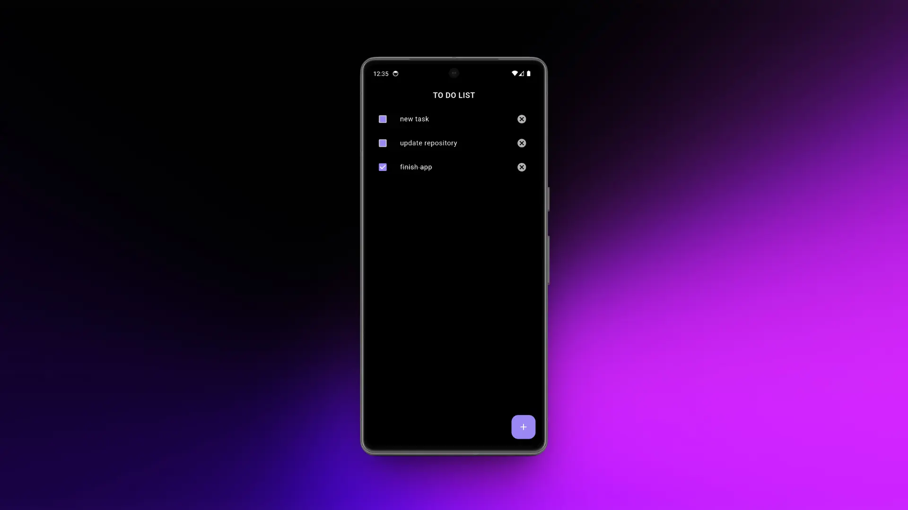
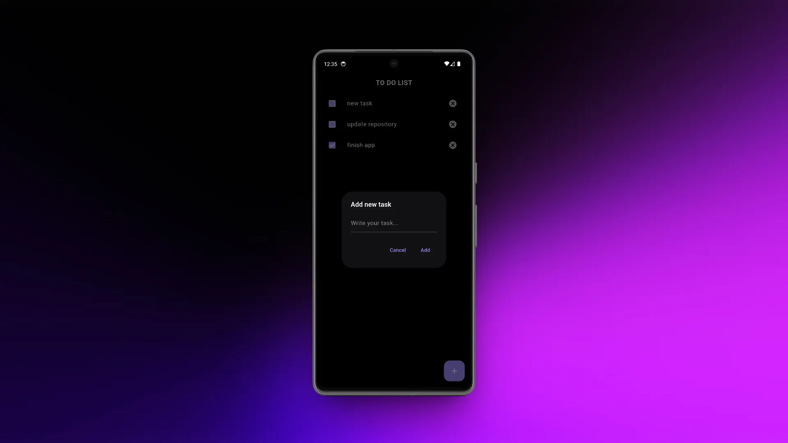

# 📝 To Do App (to_do_bloc_app)

Aplicación de lista de tareas desarrollada con **Flutter** y **Dart**, siguiendo los principios de **Clean Architecture** y utilizando **Bloc** para la gestión de estado.  
La persistencia de datos se realiza con **Isar Database**, ofreciendo un rendimiento rápido y eficiente en dispositivos móviles.

## 📸 Capturas de pantalla

| Lista de tareas | Tema oscuro |
|-----------------|-------------|
|  |  |

## ⚙️ Tecnologías utilizadas
- Flutter & Dart  
- Clean Architecture  
- Bloc (gestión de estado)  
- Isar Database (persistencia local)  
- Path Provider  

## 🚀 Funcionalidades
- Añadir nuevas tareas  
- Marcar tareas como completadas  
- Eliminar tareas  
- Guardado automático en base de datos local  
- Diseño oscuro minimalista  

## ▶️ Ejecución del proyecto
```bash
# Clonar el repositorio
git clone https://github.com/deviitt11/to_do_bloc_app.git

# Entrar en la carpeta del proyecto
cd to_do_bloc_app

# Instalar dependencias
flutter pub get

# Ejecutar en modo debug
flutter run
```

# 📝 To Do App (to_do_bloc_app)

Task management app built with **Flutter** and **Dart**, following **Clean Architecture** principles and using **Bloc** for state management.  
Data persistence is handled with **Isar Database**, providing fast and efficient performance on mobile devices.

## 📸 Screenshots
*(Add your app screenshots here, for example in `assets/screenshots/`)*

| Task list | Dark theme |
|-----------|------------|
|  |  |

## ⚙️ Tech Stack
- Flutter & Dart  
- Clean Architecture  
- Bloc (state management)  
- Isar Database (local persistence)  
- Path Provider  

## 🚀 Features
- Add new tasks  
- Mark tasks as completed  
- Delete tasks  
- Automatic local database saving  
- Minimalist dark theme  

## ▶️ Run the project
```bash
# Clone the repository
git clone https://github.com/yourusername/to_do_bloc_app.git

# Enter the project folder
cd to_do_bloc_app

# Install dependencies
flutter pub get

# Run in debug mode
flutter run
```
